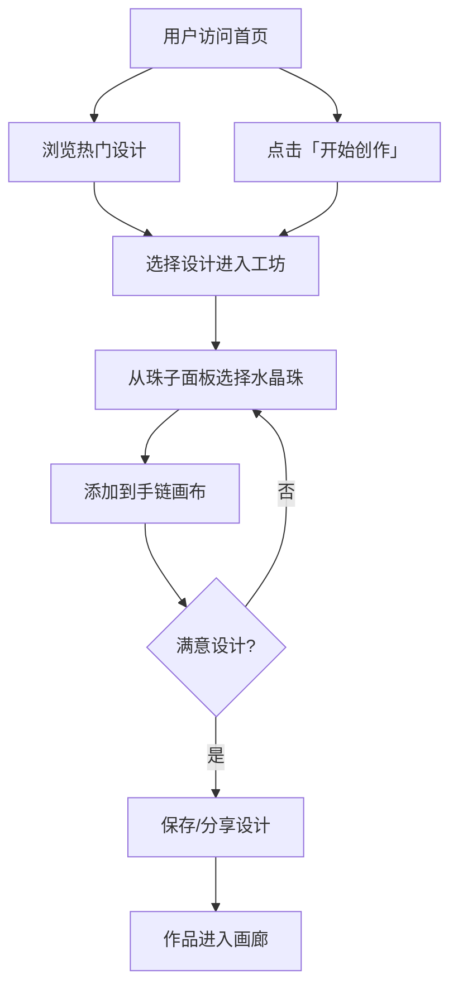

## 1. 产品概述

水晶手链 DIY 网站是一个让用户自由设计个性化水晶手链的交互式 Web 应用。用户可以选择不同种类、颜色、大小的水晶珠子，通过拖拽或点击的方式在手链上排列组合，实时预览设计效果，打造独一无二的水晶手链。

- **目标用户**：水晶爱好者、手工艺爱好者、寻找个性化饰品的人群
- **核心价值**：降低水晶手链设计门槛，让每个人都能轻松创作专属饰品

## 2. 核心功能

### 2.1 用户角色

| 角色 | 说明 |
|------|------|
| 普通用户 | 无需注册即可使用全部 DIY 功能，可保存和分享设计 |

### 2.2 功能模块

1. **首页**：品牌展示、热门设计推荐、快速进入设计工坊入口
2. **设计工坊**：核心 DIY 编辑页面，提供珠子选择、手链编排、实时预览
3. **作品画廊**：展示用户保存的设计作品，支持浏览和加载到编辑器

### 2.3 页面详情

| 页面名称 | 模块名称 | 功能描述 |
|----------|----------|----------|
| 首页 | Hero 区 | 精美的全屏品牌展示，突出水晶主题和 DIY 理念 |
| 首页 | 热门设计 | 卡片式展示精选水晶手链设计，点击可进入设计工坊 |
| 首页 | 开始创作 CTA | 醒目的行动号召按钮，引导用户进入设计工坊 |
| 设计工坊 | 珠子面板 | 侧边栏展示可选水晶珠子（按颜色/种类分类），支持拖拽 |
| 设计工坊 | 手链画布 | 圆形手链可视化编排区域，珠子实时排列预览 |
| 设计工坊 | 操作工具栏 | 撤销、重做、清空、保存、分享等操作按钮 |
| 设计工坊 | 珠子详情 | 点击珠子显示材质、寓意、价格等信息 |
| 作品画廊 | 作品网格 | 已保存设计的瀑布流/网格展示 |
| 作品画廊 | 作品详情 | 点击作品放大查看，支持加载到编辑器继续编辑 |

## 3. 核心流程

## 4. 用户界面设计

### 4.1 设计风格

- **主题色调**：以深色奢华背景为主（深紫/黑金），搭配水晶光泽感的高亮色
- **主色**：深紫 `#1a0a2e`，金色 `#d4a843`，亮白 `#f8f0e3`
- **辅助色**：水晶粉 `#e8b4c8`、水晶蓝 `#a8d4e6`、水晶绿 `#b8d4a8`
- **按钮风格**：圆角精致按钮，金色渐变描边，悬停时发光效果
- **字体**：标题使用优雅衬线字体（Playfair Display），正文使用现代无衬线字体
- **布局风格**：桌面端优先，卡片式与全屏结合
- **氛围**：奢华、神秘、灵性，使用微妙的粒子/光晕动画增强水晶质感

### 4.2 页面设计概览

| 页面名称 | 模块名称 | UI 元素 |
|----------|----------|---------|
| 首页 | Hero 区 | 全屏暗色背景 + 水晶光晕动画，居中品牌标题，金色渐变 CTA 按钮 |
| 首页 | 热门设计 | 横向滚动卡片，每张展示手链预览 + 设计者信息，玻璃拟态卡片 |
| 首页 | 导航栏 | 顶部固定，半透明毛玻璃效果，Logo + 菜单链接 |
| 设计工坊 | 珠子面板 | 左侧抽屉式面板，珠子以圆形缩略图网格排列，按分类标签筛选 |
| 设计工坊 | 手链画布 | 中央区域，手链以圆形排列展示，每颗珠子可拖拽重排、点击删除 |
| 设计工坊 | 操作工具栏 | 底部或顶部固定栏，图标按钮 + 颜色计数指示器 |
| 作品画廊 | 作品网格 | Masonry 瀑布流布局，卡片悬停显示作品名和操作按钮 |

### 4.3 响应式设计

- **桌面端（≥1280px）**：双栏布局，左侧珠子面板 + 右侧画布
- **平板端（768px-1279px）**：可折叠珠子面板，画布居中
- **手机端（<768px）**：底部抽屉式珠子选择器，画布全屏，操作栏固定在底部

### 4.4 3D 场景引导

不适用（本项目为 2D 平面设计工具，使用 CSS 动画和光影效果模拟水晶质感）。