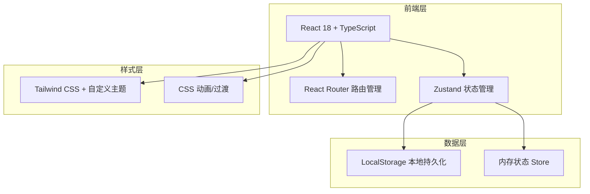
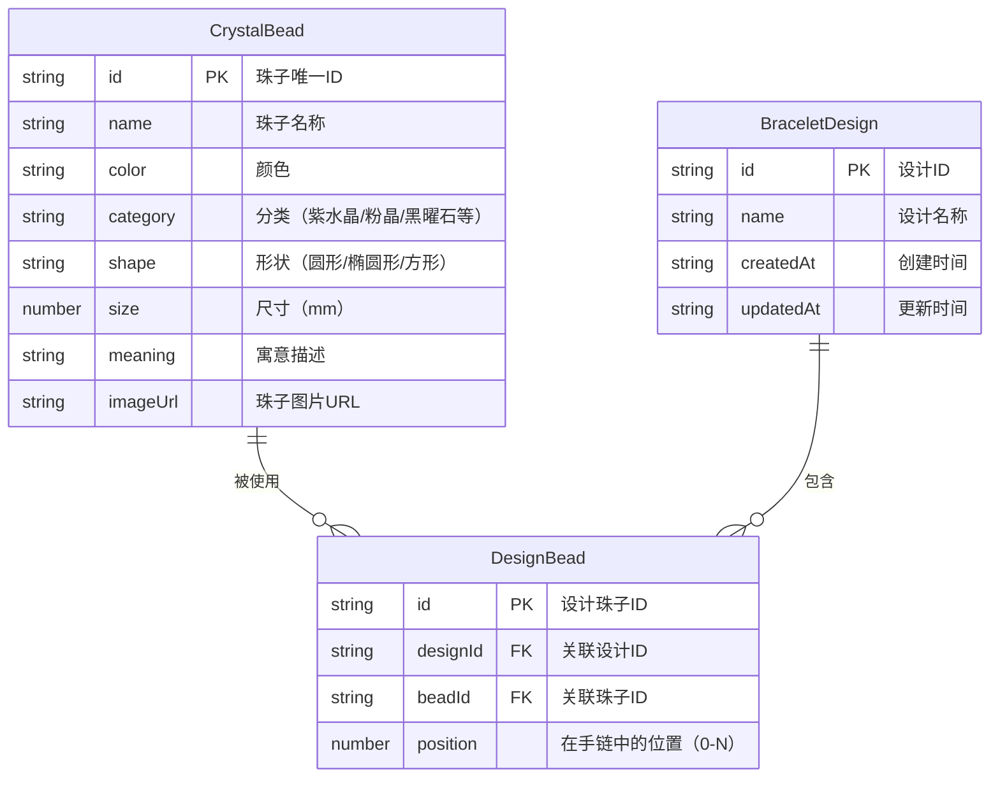

## 1. 架构设计



## 2. 技术选型

- **前端框架**：React 18 + TypeScript
- **构建工具**：Vite
- **样式方案**：Tailwind CSS 3 + 自定义 CSS 变量
- **状态管理**：Zustand
- **路由**：React Router v6
- **图标**：Lucide React
- **后端**：无（纯前端应用，使用 LocalStorage 持久化）
- **项目模板**：react-ts

## 3. 路由定义

| 路由 | 页面组件 | 用途 |
|------|----------|------|
| `/` | `Home` | 首页，品牌展示和热门设计 |
| `/studio` | `Studio` | 设计工坊，核心 DIY 编辑页 |
| `/gallery` | `Gallery` | 作品画廊，展示已保存设计 |

## 4. API 定义

本项目为纯前端应用，无后端 API。数据通过 Zustand Store 管理，持久化至 LocalStorage。

## 5. 数据模型

### 5.1 数据模型定义



### 5.2 TypeScript 类型定义

```typescript
// 水晶珠子
interface CrystalBead {
  id: string;
  name: string;
  color: string;
  category: string;
  shape: 'round' | 'oval' | 'square' | 'heart';
  size: number; // mm
  meaning: string;
  colorHex: string; // 用于渲染颜色
}

// 手链设计
interface BraceletDesign {
  id: string;
  name: string;
  beads: DesignBead[];
  createdAt: string;
  updatedAt: string;
}

// 设计中的珠子（带位置）
interface DesignBead {
  id: string;
  beadId: string;
  bead: CrystalBead;
  position: number;
}

// Zustand Store
interface StudioStore {
  // 当前编辑的设计
  currentDesign: BraceletDesign;
  // 珠子库
  beadLibrary: CrystalBead[];
  // 历史记录（用于撤销/重做）
  history: DesignBead[][];
  historyIndex: number;
  // 操作
  addBead: (bead: CrystalBead) => void;
  removeBead: (position: number) => void;
  reorderBeads: (from: number, to: number) => void;
  undo: () => void;
  redo: () => void;
  clearDesign: () => void;
  saveDesign: (name: string) => void;
  loadDesign: (designId: string) => void;
  // 画廊
  savedDesigns: BraceletDesign[];
  getSavedDesigns: () => BraceletDesign[];
  deleteDesign: (designId: string) => void;
}
```

## 6. 组件树

```
App
├── Layout
│   └── Navbar
├── Home (首页)
│   ├── Hero
│   └── FeaturedDesigns
│       └── DesignCard[]
├── Studio (设计工坊)
│   ├── BeadPanel (珠子面板)
│   │   ├── CategoryFilter
│   │   └── BeadGrid
│   │       └── BeadItem[]
│   ├── BraceletCanvas (手链画布)
│   │   └── BeadOnBracelet[]
│   ├── Toolbar (工具栏)
│   └── BeadDetail (珠子详情弹窗)
└── Gallery (作品画廊)
    └── DesignCard[]
```